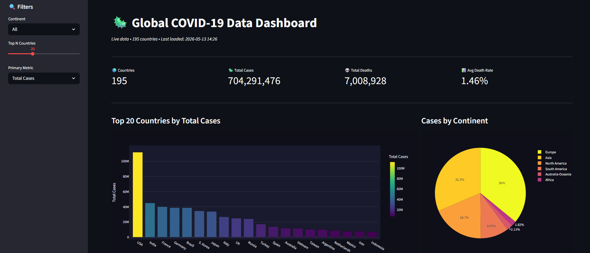
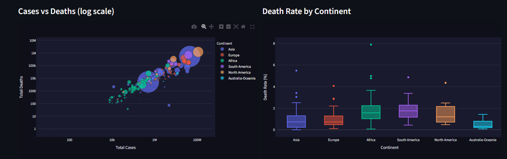
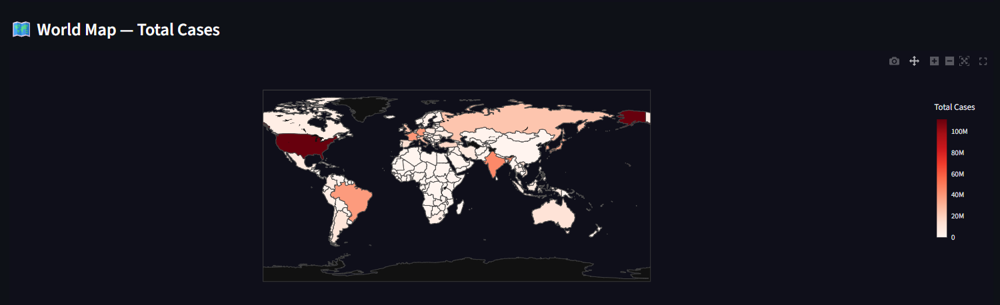

# 📊 Global COVID-19 Data Dashboard

An interactive data analysis dashboard built with **Python, Pandas, Streamlit, and Plotly**.
Fetches live data from the disease.sh API and visualizes global COVID-19 statistics.


## ✨ Features

- **Live Data** — Fetches real-time stats from disease.sh API (190+ countries)
- **Interactive Filters** — Filter by continent, top N countries, primary metric
- **5 Chart Types** — Bar, Pie, Scatter, Box plot, and Choropleth world map
- **KPI Cards** — Summary metrics at a glance
- **Sortable Data Table** — Full dataset with all metrics

## 🛠️ Tech Stack

| Layer | Technology |
|-------|-----------|
| Data Analysis | Python, Pandas |
| Visualization | Plotly Express |
| Dashboard | Streamlit |
| Data Source | disease.sh REST API |

## 🚀 Getting Started

```bash
git clone https://github.com/ruckfuss/data-analysis-dashboard.git
cd data-analysis-dashboard
pip install -r requirements.txt
streamlit run app.py
```

## 📸 Screenshot





## 📌 What I Learned

- Data wrangling and analysis with Pandas
- Building interactive visualizations with Plotly
- Creating web dashboards with Streamlit
- Working with REST APIs and real-world datasets
- Statistical analysis (death rates, per-capita metrics)